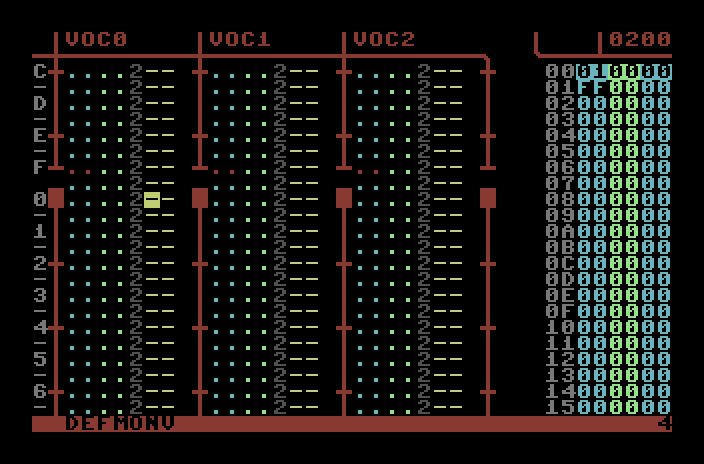

# defMONV

defMONV patches [defMON](https://defmon.vandervecken.com) — the C64 music
tracker — to drive a [Vessel](https://github.com/anarkiwi/vessel) MIDI interface
on the user port, replacing defMON's "ScannerBoy" sync. **Phase 1** makes defMON
a **MIDI clock master**: it transmits MIDI Clock, Start and Stop over real MIDI
out as you play.



See [docs/USAGE.md](docs/USAGE.md) for what's on screen and the transport keys
(F3 = play/Start, F7 = stop/Stop, Clock streams while playing).

The build takes a pinned fork of the
[undefmon](https://github.com/anarkiwi/undefmon) Kick Assembler disassembly
(`vendor/defmon.asm`), applies the Vessel patch, assembles, exomizer-packs, and
writes a runnable `.d64`. Tag a release and CI builds a versioned disk image as
a release asset.

## How it works

defMON's ScannerBoy sync bit-bangs CIA2 port B (`$DD01`) from the player tick:
`$0C`/`$04` while playing (PB2 = run, PB3 = clock), `$00` on stop. A Vessel on
the user port transmits every byte written to `$DD01` (in output mode) as MIDI,
so the patch replaces those writes with MIDI real-time messages:

| defMON site | ScannerBoy | defMONV |
|-------------|-----------|---------|
| `$0B2E` clock-high (per main tick) | write `$0C` | **MIDI Clock `$F8`** |
| `$0B46` clock-low (per sub-frame) | write `$04` | suppressed (no stray byte) |
| `$0CCA` `stop_playback` | write `$00` | **MIDI Stop `$FC`** |
| `$81E5` play-from-start (F3) tail | — | **MIDI Start `$FA`** (stub at `$E787`) |

It also overwrites defMON's on-screen build stamp (`$0FF2`, normally the date
`20201008`) with **`DEFMONV`**, so the seqED status line makes it obvious you are
running the Vessel build.

defMON already configures the user port for output (`$DD03=$FF`, PA2 high) at
cold boot and keeps KERNAL banked out (`$01=$35`), so no port setup is needed
and the Start stub lives just above the image. The patch is byte-size-preserving
in place; see [`tools/patch_vessel.py`](tools/patch_vessel.py) and
[`docs/PHASE2.md`](docs/PHASE2.md) for the external-clock (slave) follow-up.

## Build

Requires `java` (Kick Assembler v5.25 is vendored at `vendor/KickAss.jar`),
[`exomizer`](https://bitbucket.org/magli143/exomizer) 3.1.2, `c1541` (VICE), and
Python 3.

```
make            # patch -> assemble -> verify -> exomize -> defmonv.d64
make verify     # assemble and assert every patch site (no emulator)
```

## Releasing

Push a tag (`vX.Y.Z`) and `.github/workflows/release.yml` builds
`defmonv-<tag>.d64` and attaches it to a GitHub Release. `build.yml` builds and
verifies on every push/PR and uploads the d64 as a CI artifact.

## Tests

* **`make verify`** — static assertion that the assembled image has the expected
  bytes at every patch site. Runs in CI, no emulator.
* **`tests/integration_test.py`** — boots the packed `.d64` in
  [asid-vice](https://github.com/anarkiwi/asid-vice) via
  [defmon-driver](https://github.com/anarkiwi/defmon-driver), plays, and checks
  the user port emits MIDI Clock/Start/Stop (and never the ScannerBoy bytes).
  Needs Docker + an `asid-vice:latest` image and the `defmon-driver` /
  `vice-driver` packages on `PYTHONPATH`:

  ```
  make test
  ```

## Provenance

`vendor/defmon.asm` is a verbatim copy of undefmon at the commit in
[`vendor/UNDEFMON_COMMIT`](vendor/UNDEFMON_COMMIT); it round-trips byte-for-byte
to the original defMON image, so the only changes in defMONV are this patch.
defMON is the work of its authors; defMONV is an independent patch.
